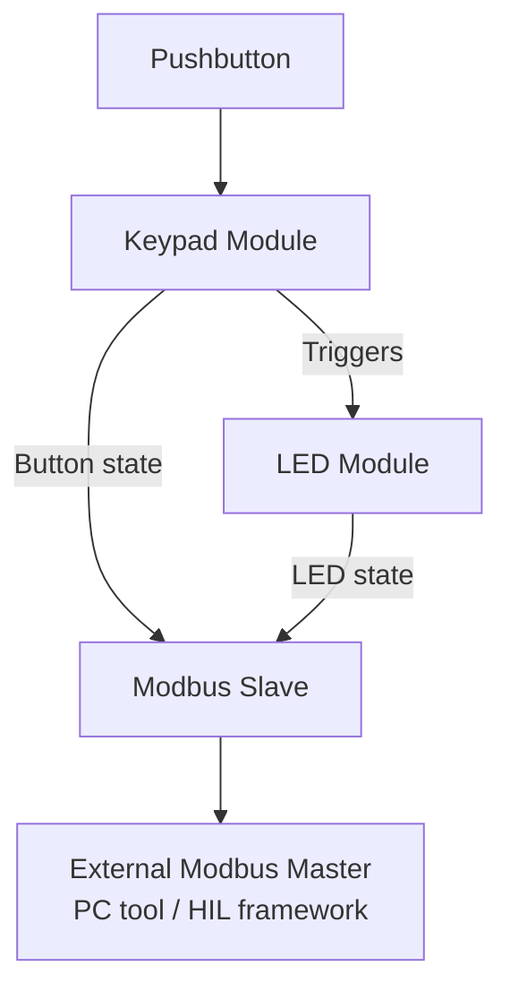
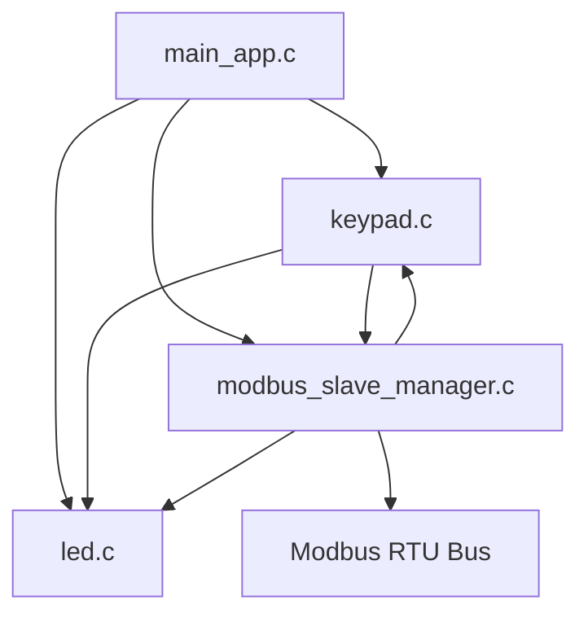

# 📘 Project Architecture Overview

This document provides a one‑page overview of the architecture, data flow, and module relationships of the demo project used for testing within the course. The goal is to help learners understand **what the system does**, **how modules interact**, and **which elements will be tested**.

---

## 🏗️ High‑Level Description

The project is a simple embedded application that:

* Reads a **pushbutton** (with debouncing and long/short‑press detection)
* Controls an **LED** based on button interactions
* Exposes internal states (LED + button) via a **Modbus RTU slave interface**
* Runs a minimal **main loop** that updates all modules

This small but complete stack enables realistic HIL (Hardware‑In‑the‑Loop) test examples.

---

## 🔌 Main Components

### **1. Keypad Module (`keypad.c`)**

Responsible for handling a single user button.

* Initializes the pushbutton driver
* Registers callbacks:

  * **Short press → disable LED**
  * **Long press → enable LED**
* Periodically checks button state
* Handles debouncing and repetition timers

### **2. LED Module (`led.c`)**

A thin abstraction over GPIO operations.

* Initializes the LED GPIO
* Provides `enable_led()`, `disable_led()`, and `get_current_LED_state()`

### **3. Modbus Slave Manager (`modbus_slave_manager.c`)**

Publishes internal application states to Modbus.

* Initializes Modbus in RTU mode
* Exposes two discrete inputs:

  * **Address 0 — LED state**
  * **Address 1 — Button pressed state**
* Periodically checks for Modbus requests
* Updates Modbus registers with current values

### **4. Main Application (`main_app.c`)**

The main loop coordinating the system.

* Initializes all modules (LED, keypad, Modbus)
* Repeatedly calls:

  * `keypad_update()`
  * `modbus_slave_manager_update()`

---

## 🔄 System Flow Summary

---

## 🧩 Module Dependency Diagram

---

## 🎯 What the User Can Test

HIL tests in the course can validate:

* Correct LED reaction to short/long button presses
* Proper Modbus reporting of:

  * LED state
  * Button pressed state
* Robustness of debouncing and pushbutton logic
* Integration of all modules in the main loop

This architecture ensures realistic testing scenarios while keeping the codebase compact and easy to understand.
