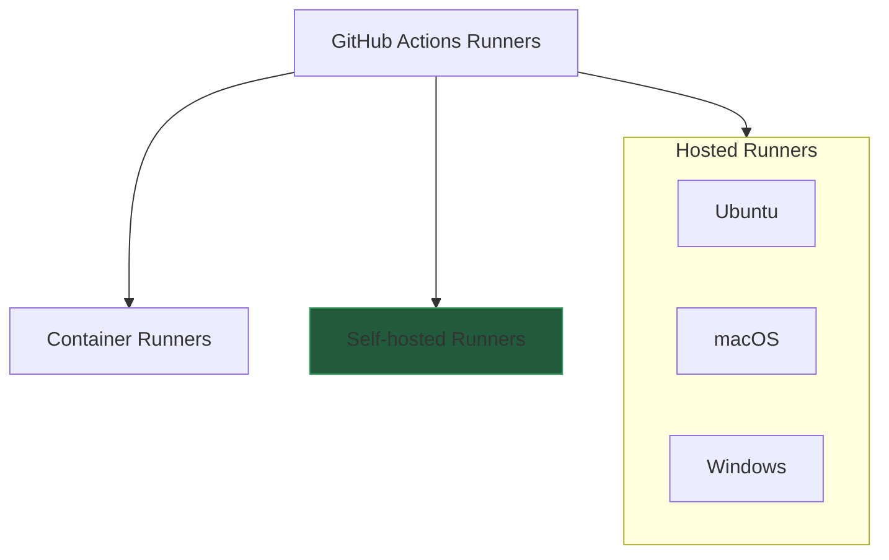

# Graf rodzajów GitHub Actions Runners

```mermaid
flowchart TD
    A[GitHub Actions Runners]

    A --> SUB[Hosted Runners]
    A --> C[Container Runners]
    A --> D[Self-hosted Runners]

    %% Jeden „zbiorczy” prostokąt z trzema prostokątami w środku

    subgraph SUB[" Hosted Runners "]
        UB[Ubuntu]
        MAC[macOS]
        WIN[Windows]
    end
    style D fill:#225b3c,stroke:#3fa46b,stroke-width:1px
```
